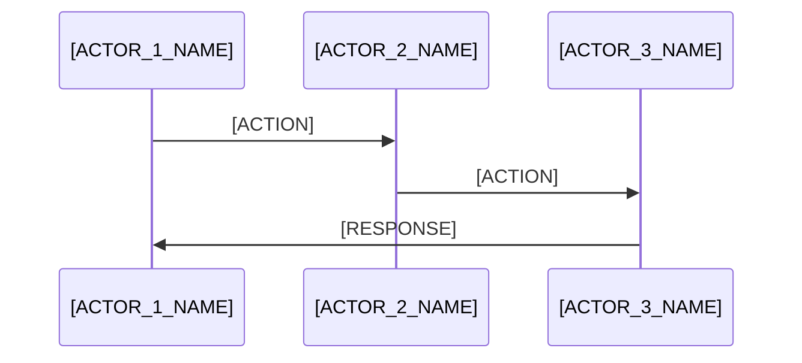

Goal: capture minimal viable solution design in minimalest way possible but robust and whole. 
Criteria: 0 extra characters. 0 unnecessary things. 0 unnecessary verbiage.

---
description: Create minimal viable solution design document
---

# Minimal Viable Solution Design: [FEATURE_NAME]

## Pre-requirements
- [ ] [PREREQUISITE_1]
- [ ] [PREREQUISITE_2]
- [ ] [PREREQUISITE_3]

**Dependencies:** [PACKAGE_NAME] (^VERSION), [PACKAGE_NAME] (^VERSION)

## Architecture
[ONE_LINE_DATA_FLOW_SUMMARY]



## Types
```typescript
import { z } from 'zod'

const [ENTITY]Schema = z.object({
  [FIELD_1]: z.[TYPE](),
  [FIELD_2]: z.[TYPE](),
})

type [ENTITY] = z.infer<typeof [ENTITY]Schema>

interface [FEATURE]State {
  [STATE_FIELD_1]: [TYPE]
  [STATE_FIELD_2]: [TYPE]
}

interface [FEATURE]Actions {
  [ACTION_1]: ([PARAMETERS]) => [RETURN_TYPE]
  [ACTION_2]: ([PARAMETERS]) => [RETURN_TYPE]
}

type [FEATURE]Store = [FEATURE]State & [FEATURE]Actions
```

## Validation Strategy
- **Input:** [INPUT_VALIDATION_APPROACH]
- **Read:** [READ_VALIDATION_APPROACH]
- **Write:** [WRITE_VALIDATION_APPROACH]
- **Hydration:** [HYDRATION_VALIDATION_APPROACH]

## Implementation
**Location:** `[PATH_TO_IMPLEMENTATION_FILE]`

The [IMPLEMENTATION_NAME] implements:
- [IMPLEMENTATION_DETAIL_1]
- [IMPLEMENTATION_DETAIL_2]
- [IMPLEMENTATION_DETAIL_3]
