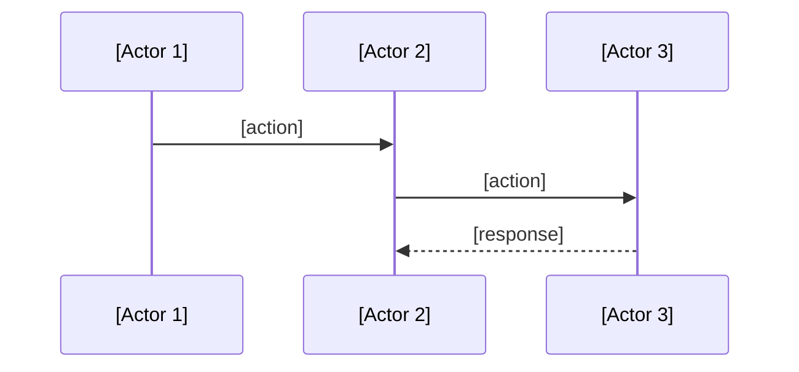

Adhere with strict discipline: keep everything robust, coherent, simplest possible, professional. If anything complicates or is vague, please stop immediately and ask for clarification.

Template: Technical Solution Design
Goal: capture technical solution design in minimalest possible way
Criteria: 0 unnecessary verbiage, 0 unnecessary characters

# Technical Solution: [Name]

## Q & A Research & Design 
- what are the domains? 
- what minimal critical knowledge to i need?
- critical choices
- what are system boundaries, data flow, and dependencies chain
- who are actors
- how do they communicate, in what order
- what's the leanest solution with least complications possible
- what are the trade offs? what are the consequences? 

# Pre-requirements and dependencies chain check - what is missing/unaligned and needs to be addressed first to make this solution possible?
## Note what was checked in minimalest way possible
## Then, note [ ] task to be solved for pre-requirements are missing in minimal but clear and complete way
- what does this solution rely on? (e.g. sanity schema must have <...> fields, a <<...> dependency must be installed, etc., )
- Trace the data flow from source to storage to identify ALL external system dependencies
- List all external systems this solution interacts with and their required fields/configurations
- Distinguish between current schema state and required schema state for solution
- If solution requires fields that don't currently exist, note them as "TO BE ADDED" or "schema migration required"
- Verify both current state AND required state - if they differ, note the gap
- List schema changes needed as implementation tasks if fields are missing
- If schema changes affect existing data, note migration requirements
- note here in minimalest manner possible but clear

# Critical Checks
- what am i missing? 
- what illusions did i fall for?
- what did i not check? 
- what assumptions have i made?
- what is unnecessary that i failed to question and delete?
- what are the threats? what might complicate?
- what problems will arise? what will go slow? 
- what will be painful to verify?
- what will require painful rework?

## Architecture
- [Actor 1] does [single responsibility]
- [Actor 2] does [single responsibility]
- [Actor 3] does [single responsibility]
...



## Types
```typescript
interface [Name] {
  [field]: [type]
}
```

## Validation
- Input validation: [rules]
- Hydration validation: [checks before loading from storage]
- Schema validation: [expected structure]

## Behaviors
- When [event], [actor] does [action] → [result]
- When [event], [actor] does [action] → [result]

## Happy Path
- When [event], [actor] does [action] → [success state]
- When [event], [actor] does [action] → [success state]

## Edge Cases
- When [failure], system [fallback behavior]
- When [failure], system [fallback behavior]

## Fallback Strategies
- [Primary approach] → [Backup approach] → [Graceful degradation]

## ...
