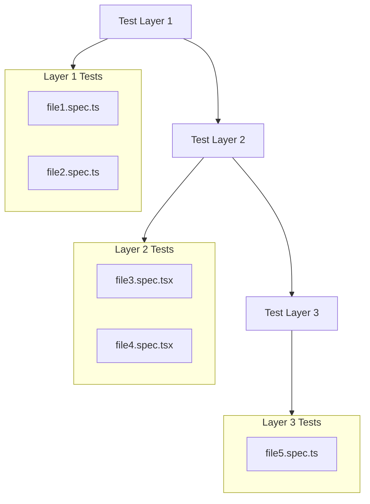

# /tests-plan [FEATURE_NAME]

**Input:** Folder link <feature name> or <sub-feature-name>, 1. 1. PRD.md, 2. HTML Structure.md, Technical Solution Design.md inside `docs/[feature]/...` or `docs/[feature]/[sub-feature]/...`
**Output:** `docs/[feature]/(optionally [sub-feature]/Tests Plan.md` — diagram + file list with 1-sentence descriptions

## Execution Steps
1. **Plan:** Define test layers (unit, integration, e2e) based on feature
2. **List:** Planned test files with paths
3. **Diagram:** Create Mermaid flowchart showing planned test layers and files
4. **Describe:** For each planned file, write 1-sentence description of what it will test
5. **Format:** Use universal format (diagram + file list)

## Output Format

```markdown
# Tests Plan: [Feature Name]



## Test Files

### [Layer Name]
- **/path/to/file.spec.ts** - Tests [what exactly, 1 sentence max]
- **/path/to/file2.spec.ts** - Tests [what exactly, 1 sentence max]
```

## Constraint Rules

- **NO** strategy sections, intelligence gathered, gaps fixed
- **NO** verbose descriptions beyond 1 sentence per file
- **NO** test order or naming convention sections
- **ALL** file paths must be relative to __tests__ folder
- **ALL** descriptions must be exactly 1 sentence, present tense
- **DIAGRAM** must show actual file names from __tests__ folder
